## A quoi ca ressemble, un module ?

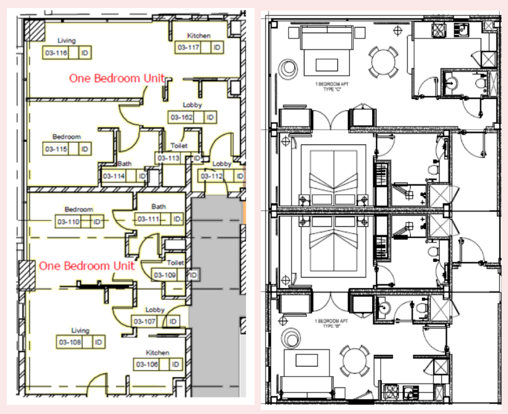
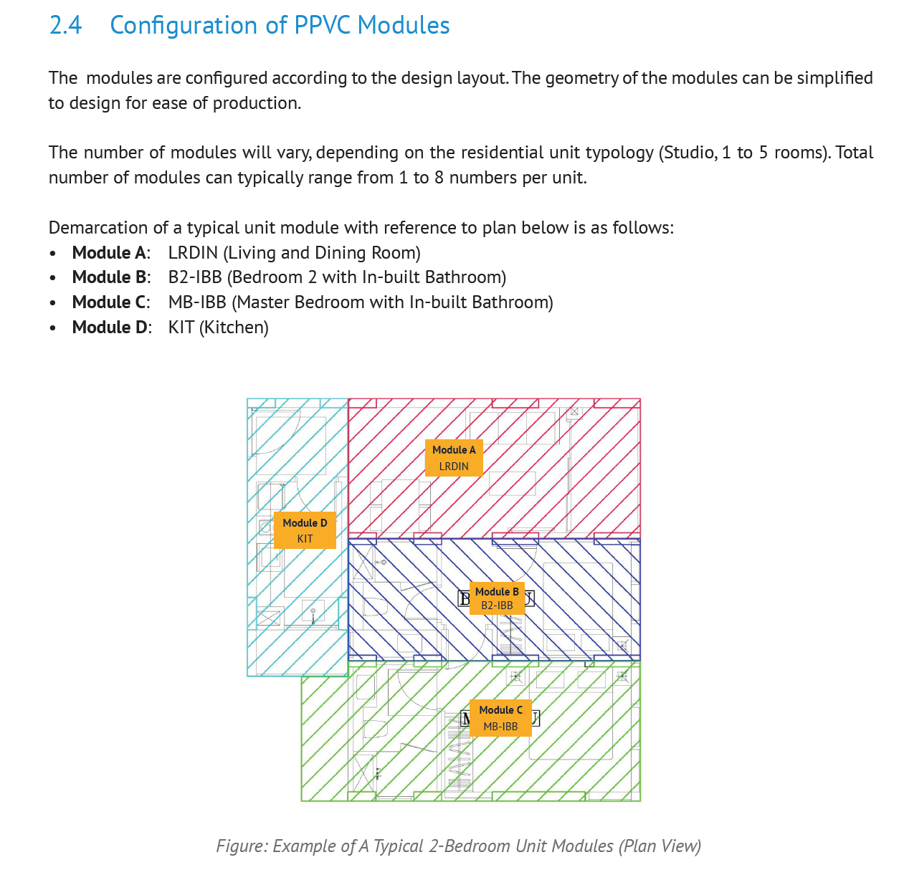
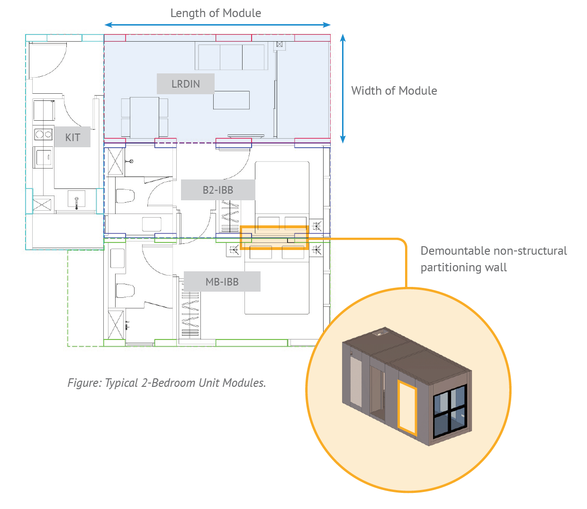
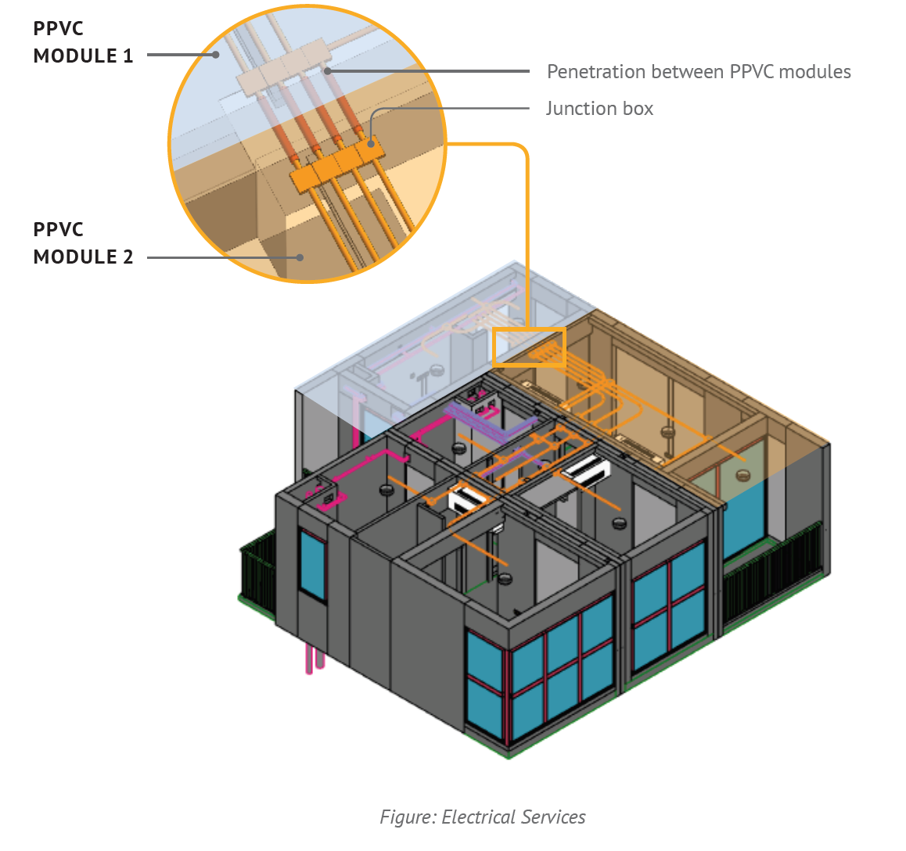

## La métaphore du tatami

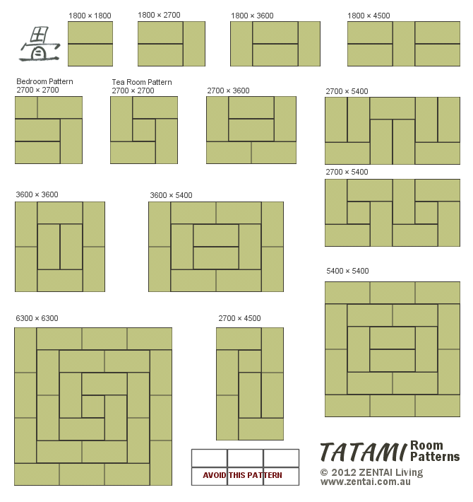

## Assemblage

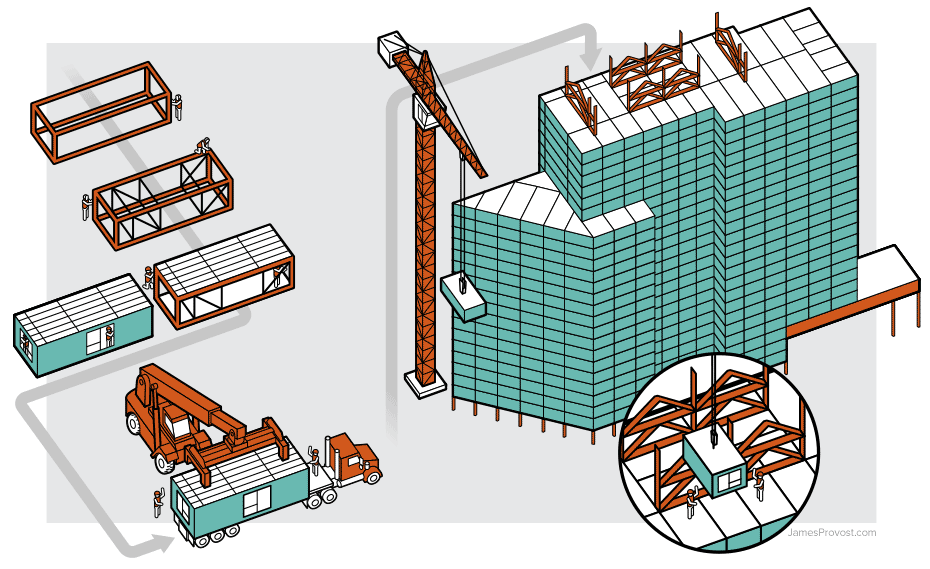
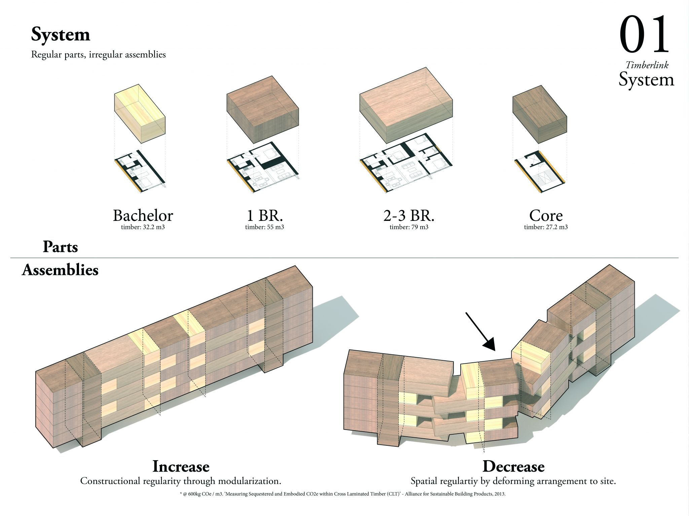

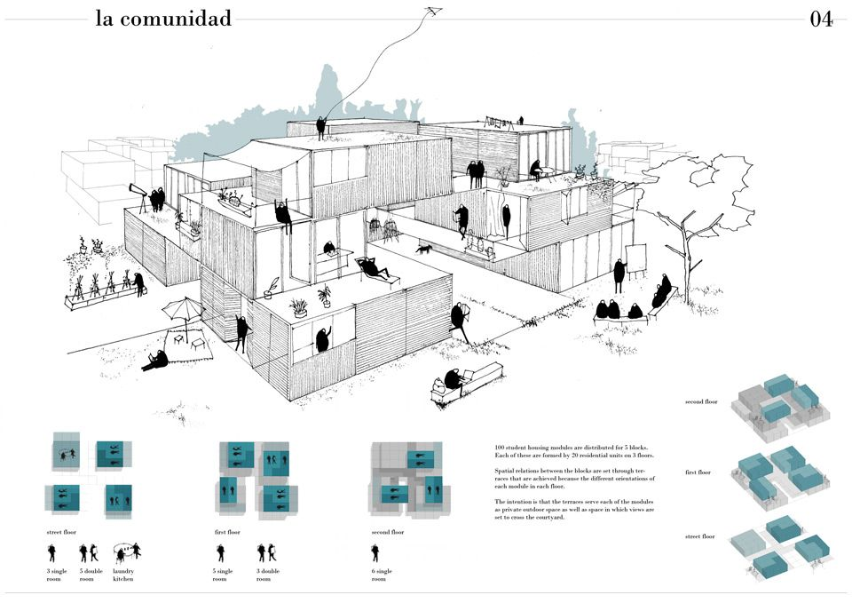
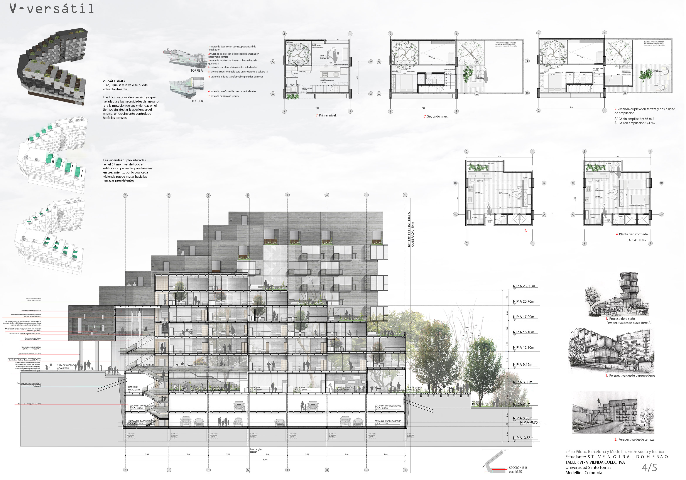
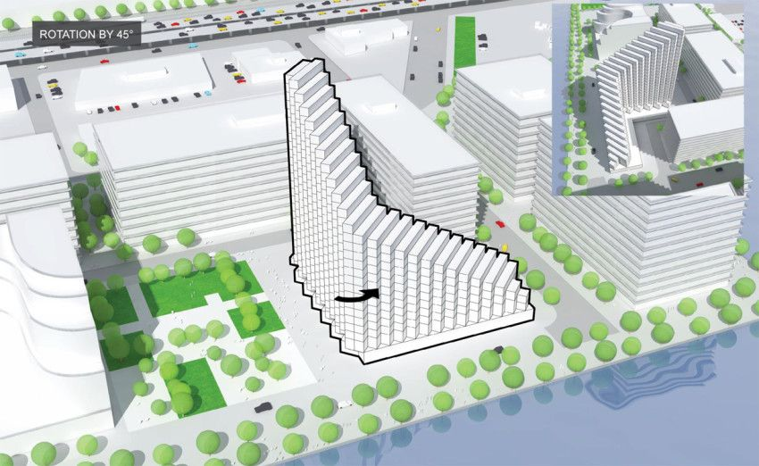
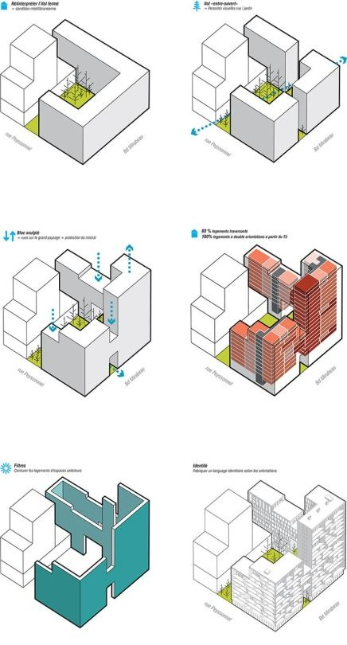
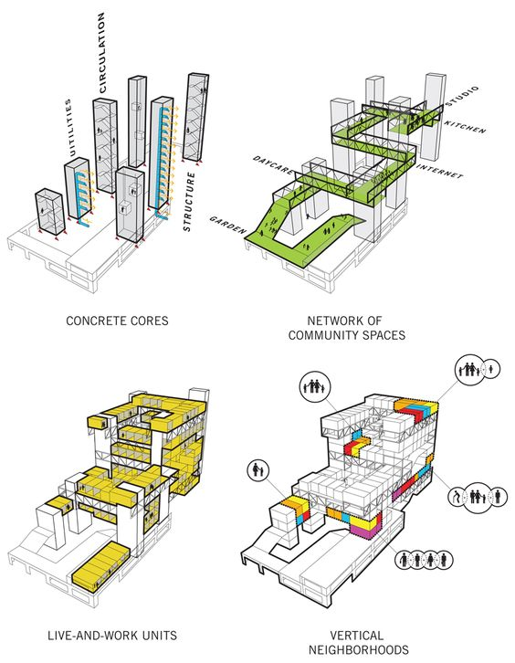
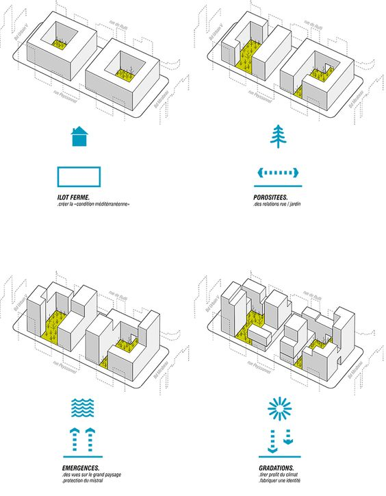
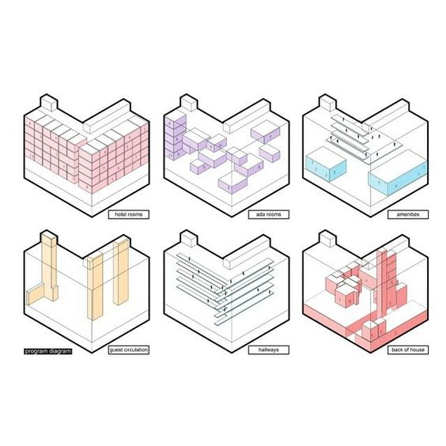
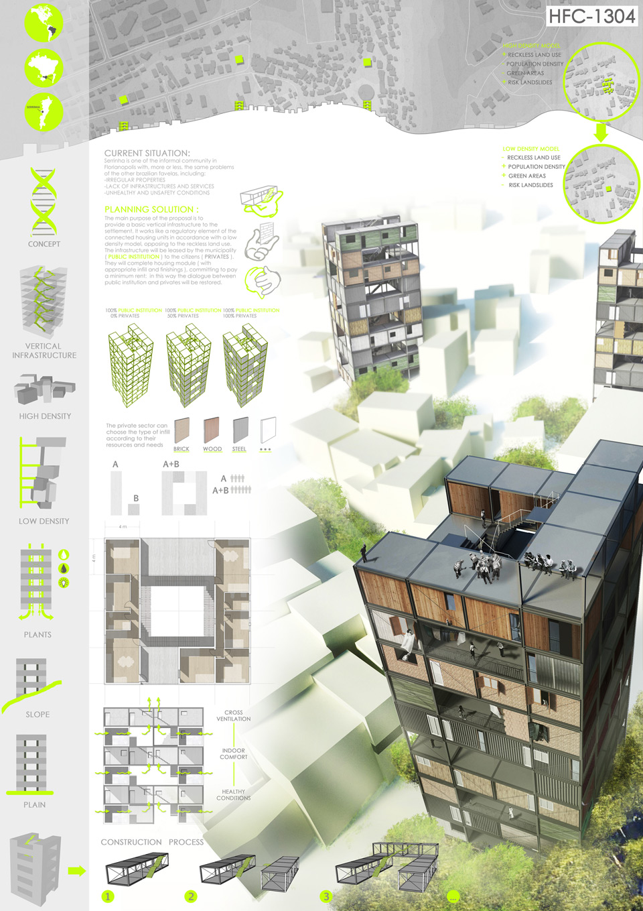

## Generative Design

[Modular Level Design](https://fr.slideshare.net/JoelBurgess/gdc-2016-modular-level-design-of-fallout-4)
[Video Houdini](https://www.youtube.com/watch?v=bXM7Hx51Qb0)
[Video Houdini](https://www.youtube.com/watch?v=g_K6lWBlSdc)
[Video Grammaire](https://www.youtube.com/watch?v=t-VUpX-xVo4)
