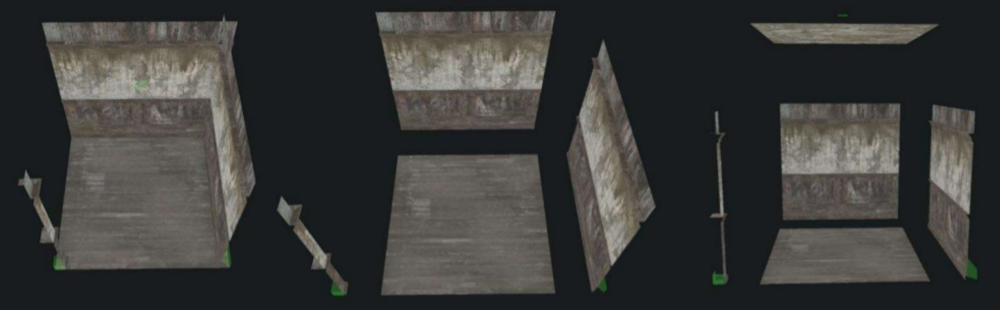
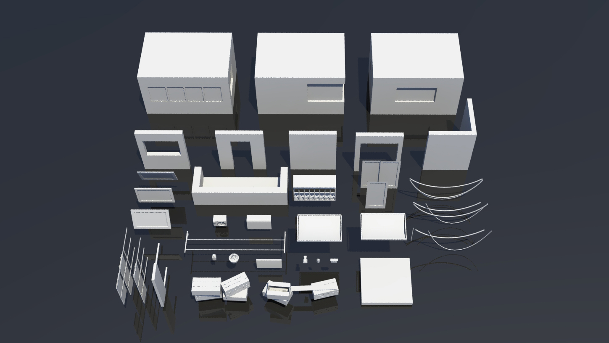

## A quoi ca ressemble, un module ?

## La métaphore du tatami

## Assemblage

## Generative Design

* **[Modular Level Design](https://fr.slideshare.net/JoelBurgess/gdc-2016-modular-level-design-of-fallout-4)**
	* Dans ces slides, vous retrouvez un exemple des principes de construction modulaire qui sont utilisées pour créer nombre de jeux vidéo. C'est finalement très proche de ce que l'on fait en construction par assemblage de panneaux. Evidémment, les batiments que l'on concoit dans les jeux vidéo sont rarement fonctionnels, puisque par nature, ils doivent poser problème au joueur pour que ce dernier puisse jouer :)  

	
* **[Houdini](https://www.sidefx.com/)**
	* Houdini est un outil de conception procédural à destination principalement du cinéma et du jeux vidéo. On y retrouve probablement nombre d'exemples pertinents pour la génération des facades et/ou des batiments entier.
	* [Video Houdini](https://www.youtube.com/watch?v=bXM7Hx51Qb0)
	* [Video Houdini](https://www.youtube.com/watch?v=g_K6lWBlSdc)

	
* **[Grammaire L-System](https://en.wikipedia.org/wiki/L-system)**
	* Ces grammaires sont souvent utilisées dans l'imagerie pour générer des structures naturelles (végétations...) parce qu'elle peuvent produire un nombre infini de variations. Elles sont aussi utiles pour générer de grands blocs urbains par exemple.
	* [Video Grammaire](https://www.youtube.com/watch?v=t-VUpX-xVo4)

* **[The Architect Paris](https://www.thearchitect-thegame.paris/en/home)**
	* Ce jeu est produit par un cabinet d' architecture parisien. Je vous invite à jeter un oeil sur le module de génération de facade, assez complet, pour nous donner une idée de ce que nous pouvons réaliser de mieux en matière de génération en temps réel.
	* [Video YouTube](https://youtu.be/n_farDmfXZM?t=51s)

